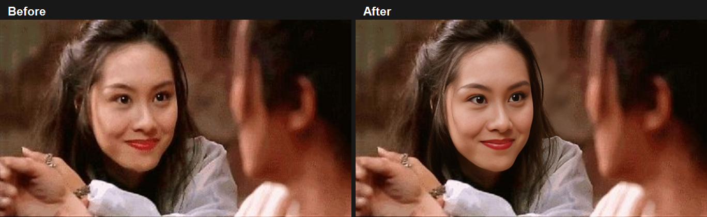
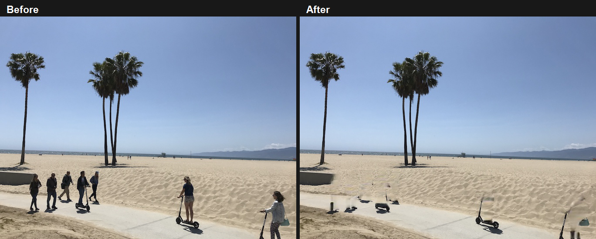
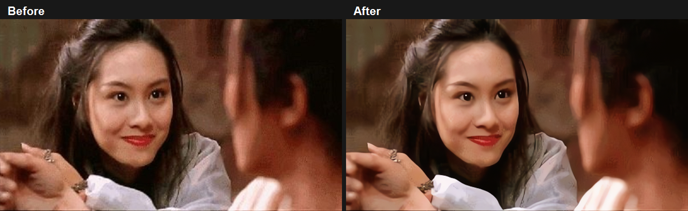
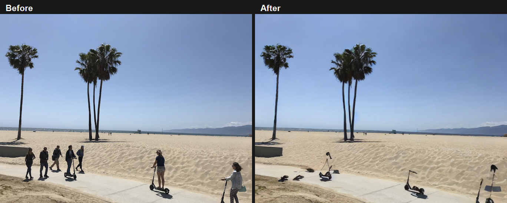

<p align="center">
  <a href="https://github.com/newzjh/AIImage">
    
  </a>
</p>

<h1 align="center">Aexis Unity Package</h1>

<p align="center">
  <a href="https://github.com/newzjh/AIImage"></a>
  <a href="https://assetstore.unity.com/preview/397636/1435586"></a>
  <a href="#community-links"></a>
  <a href="#community-links"></a>
  <a href="#license"></a>
</p>

<p align="center"><sub><a href="#at-a-glance">At a glance</a> &bull; <a href="#install">Install</a> &bull; <a href="#runner-evidence">Examples</a> &bull; <a href="#tested-environments">Tested environments</a> &bull; <a href="#how-to-help">How to help</a> &bull; <a href="#license">License</a></sub></p>

`com.aexis` is the single Unity Package Manager (UPM) package for the Aexis on-device inference engine. AIImage is an application built on Aexis; it is not the engine namespace, a package dependency, or a runtime requirement.

## At a glance

- Unity 2022.3 LTS through Unity 6000.3 package baseline.
- Self-owned NCNN and ONNX import and execution paths with Pack4 RenderTexture storage.
- No Unity Sentis, ONNX Runtime, Tencent ncnn, MNN, UniTask, or native inference-plugin runtime dependency.
- Importable reusable runners and the full AIImage Main2 application example.

### Business inquiries

For commercial, integration, or partnership discussions, contact [newzjh@126.com](mailto:newzjh@126.com).

## How to help

- [Star Aexis on GitHub](https://github.com/newzjh/AIImage) and report reproducible package issues.
- Review the package on the [Unity Asset Store](https://assetstore.unity.com/preview/397636/1435586).
- [Sponsor on GitHub](https://github.com/sponsors/newzjh) or [buy me a Ko-fi](https://ko-fi.com/newzjh).
- See the repository [support guide](../../SUPPORT.md) for current channels.

## Status and compatibility

| Item | Supported release baseline |
| --- | --- |
| Unity | 2022.3 LTS through Unity 6000.3 |
| Script runtime | Unity-supported .NET profile for the installed editor |
| GPU path | Compute-shader-capable graphics API with RenderTexture support |
| Package dependencies | Unity modules only; dynamic JSON is source-vendored in the optional application sample |
| Runtime namespaces | `Aexis`, `Aexis.Async`, `Aexis.Onnx`, `Aexis.Ncnn`, `Aexis.Execution` |

`Aexis.Async` exposes BCL `Task` and does not ship, vendor, or reference UniTask. This keeps the engine compatible with Unity 2022.3 and prevents package-level conflicts when a host project uses its own UniTask version or distribution.

## Runner evidence

AIImage Main2 is the complete application example built on Aexis. It contains runner configuration for Qwen3.5 Q4/Q8, CLIP, CodeFormer, Matting, Real-ESRGAN, GFPGAN, YOLO plus DeepFillV2, YOLO plus Stable Diffusion inpainting, and MONAI/VISTA. The following images are actual runner artifacts. In each comparison, the left panel is the input and the right panel is that runner's output.

### Qwen3.5 Mobile Q4/Q8 and CLIP MobileCLIP S0


Qwen Q4 passed a Windows strict-texture text smoke in 65.533 s using 48 cache textures. It also passed the Android MuMu Vulkan Main2 run in 326.821 s across 103 decoder steps, emitted 397 visible characters, and detected four people. Q8 passed a strict multimodal smoke in 71.618 s with six generated tokens. CLIP's successful 2026-07-23 score artifact ranked `Photo` at `0.332389` and `Portrait` at `0.265945`; its current strict CommandBuffer profile rejects an undeclared temporary RT at `transpose_121`.

### CodeFormer Face Restoration



The CodeFormer runner processed `ref/03.jpg`, detected one face, and completed in 17,958 ms (Windows/Vulkan, 2026-07-29).

### Foreground Matting


The matting runner completed at 360x202 in 1,103 ms with the strict texture plan and CommandBuffer path.

### GFPGAN Face Restoration


The GFPGAN runner processed `ref/03.jpg` in 6,053 ms with the strict Pack4 guard (Windows/Vulkan, 2026-07-29). The image is the raw output; this input visibly produces facial distortion, so it is execution evidence rather than a quality claim.

### YOLO Person Segmentation plus DeepFillV2



For `ref/deepfillv2/DeepFillv2-main/test_data/3.png`, YOLO found seven people with mask coverage `0.042730`. DeepFillV2 completed in 2,196 ms, including 1,995 ms inference (Windows/Vulkan, 2026-07-29). The result retains the actual residual removal artifacts.

### Real-ESRGAN AnimeVideo v3 x4



The CommandBuffer Pack4-only Real-ESRGAN validation processed `ref/03.jpg` in 1,057 ms (Windows/Vulkan, 2026-07-29).

### YOLO plus Stable Diffusion Inpainting



For `ref/deepfillv2/DeepFillv2-main/test_data/3.png`, YOLO found seven people with mask coverage `0.042730`; the 12-step Stable Diffusion inpainting run completed in 630,213 ms (Windows/Vulkan, 2026-07-29). It removes people more completely than the DeepFillV2 result, while retaining the actual residual objects and artifacts.

### MONAI and VISTA

> **Screenshot slot reserved:** A visual example requires reproducible, distributable medical input and confirmed data/model permissions. No medical image, private golden, checkpoint, or data result is published by this package.

## Release downloads

The Main2 model-delivery configuration resolves its assets from [newzjh/AIImage releases](https://github.com/newzjh/AIImage/releases). Download the current generated asset named in `AIImageModelReleaseManifest.json`, or use the application's model-download UI. Do not infer an archive name from a runner name.

| Model group | Release download page |
| --- | --- |
| Qwen3.5 Q4 | [`qwen3.5_0.8b_mobile_q4`](https://github.com/newzjh/AIImage/releases/tag/qwen3.5_0.8b_mobile_q4) |
| Qwen3.5 Q8 | [`qwen3.5_0.8b_mobile_q8`](https://github.com/newzjh/AIImage/releases/tag/qwen3.5_0.8b_mobile_q8) |
| CLIP, CodeFormer, Matting, and YOLO configuration | [`model`](https://github.com/newzjh/AIImage/releases/tag/model) |
| Real-ESRGAN | [`realesr`](https://github.com/newzjh/AIImage/releases/tag/realesr) |
| GFPGAN | [`gfpgan`](https://github.com/newzjh/AIImage/releases/tag/gfpgan) |
| DeepFillV2 | [`DeepFileV2`](https://github.com/newzjh/AIImage/releases/tag/DeepFileV2) |
| Stable Diffusion inpainting | [`sdinpainting`](https://github.com/newzjh/AIImage/releases/tag/sdinpainting) |
| MONAI WholeBrain | [`MONAI_WholeBrain`](https://github.com/newzjh/AIImage/releases/tag/MONAI_WholeBrain) (external model and medical data only) |
| VISTA3D skull | [`vista3d_skull`](https://github.com/newzjh/AIImage/releases/tag/vista3d_skull) (external model and medical data only) |
| VISTA3D spine | [`vista3d_spine`](https://github.com/newzjh/AIImage/releases/tag/vista3d_spine) (external model and medical data only) |

Model weights have their own licenses and redistribution conditions. The listed release pages are download locations, not license grants.

## Install

For an embedded package, add the following entry to the consuming project's `Packages/manifest.json`:

```json
{
  "dependencies": {
    "com.aexis": "file:../path-to-aexis/Packages/com.aexis"
  }
}
```

For a registry or Git release, install the published `com.aexis` package through Unity Package Manager. Do not copy `Runtime` files into `Assets`; package-local resources and assembly definitions are part of the runtime contract.

For a standalone `.unitypackage`, run `Aexis/Release/Export Complete UnityPackage` from an Aexis project, then import the exported archive with the Aexis entries selected. The import list is the original `Packages/com.aexis/...` file tree, so there is no large ZIP payload to identify or select. Unity places the files directly in `Packages/com.aexis`; the small bootstrap only confirms the Package Manager registration and then deletes itself. The package is ready without restarting the project. The Main2 application is managed directly at `Packages/com.aexis/Samples/AIImageApplicationExample`; open its scene or run its installer from there.

## Package layout

| Path | Purpose |
| --- | --- |
| `Runtime/Core` | Backend-neutral contracts, tensor descriptors, precision and quantization manifests |
| `Runtime/Onnx` | Self-owned ONNX protobuf reader and execution-planning adapters |
| `Runtime/Ncnn` | Self-owned NCNN param/bin readers, graph loader, Pack4 texture execution, operators |
| `Runtime/Execution` | ONNX shape/index texture backend |
| `Runtime/Resources/Aexis` | Compute shaders loaded through `Resources`, owned by the package |
| `Editor` | Package editor tooling |
| `Samples` | Unity-managed application examples and their model payloads |
| `Documentation~` | Package documentation rendered by Package Manager |
| `Tests/Editor` | Package boundary and planning tests |

The runtime is partitioned into multiple asmdefs inside one UPM package. Unity supports this arrangement; consumers import only `com.aexis` and get the assemblies transitively. `Aexis.Ncnn` production inference stays on Pack4 RenderTextures and CommandBuffer-compatible texture flows. Compute buffers are limited to immutable uploads and explicit diagnostic paths.

`ForwardPack4WithFixedInputs(...)` records the same strict Pack4 CommandBuffer path for mixed texture/fixed-buffer model inputs. A fixed buffer is dispatched into a GPU texture before the first layer (including exact RFloat token-id upload for `Embed`); it cannot become an activation or trigger a CPU/ComputeBuffer fallback.

## Model import and extension contracts

Unity imports `.onnx`, NCNN `.param`, and versioned `.aexis` archive files as `AexisModelAsset`. The importer preserves source bytes, emits a versioned binary graph, attaches a sibling NCNN `.bin` when present, and records lowering/preflight diagnostics on the asset. `AexisModelPackager` exposes the same offline prepack path for build tooling.

`AexisNcnnBinaryParam` is the stable binary `.param` representation and `AexisModelArchive` (`AEXM` v1) packages the binary graph, weights, source, manifest, and diagnostics. Use `AexisCustomLayerRegistry` to register a public layer factory with a versioned parameter/arity schema. Model archives may declare their required custom layer type and shader kernel id; unresolved declarations fail before execution.

P1 visual operators (`GridSample`, deformable/ROI/detection families, `Fold`, `Flip`, `GLU`, `Einsum`, `Diag`, and `SPP`) ship with built-in Pack4 RenderTexture and CommandBuffer profiles. Strict preflight reuses the same parameter/shape proof as dispatch; an unsupported profile is rejected before execution rather than materialized through a ComputeBuffer. BF16 uses FP32 texture storage because Unity has no portable BF16 render-texture format; Pack4 `Cast` provides deterministic BF16 rounding. Per-layer mixed plans select FP16/FP32/BF16 physical storage as appropriate, while calibrated signed or unsigned Pack4 INT8 plans feed Conv/DWConv/Gemm/InnerProduct dispatch directly.

## Operator and quantization status

`output/operator-capabilities/operator-capabilities.json` in the repository is the implementation snapshot used for release documentation. It lists 96 NCNN import entries (56 with both RenderTexture and CommandBuffer flags) and 19 Sentis/ONNX import entries (13 with both flags). The snapshot contains 56 `partial`, 29 `debug-only`, 5 `alias-only`, and 6 `unsupported` entries, so a flag is not a blanket model compatibility promise. Aexis imports ONNX/Sentis-dialect graphs but does not depend on Sentis or ONNX Runtime at runtime.

`ModelManifest` can represent FP32, FP16, BF16, INT8/INT4 weight-only, calibrated W8A8, and per-layer mixed plans. Checked-in model manifests include model-specific INT8/INT4 profiles for MobileCLIP and Matting. The capability snapshot has zero universal per-operator FP16/INT8 flags; use strict preflight and the model's precision gate for a concrete graph. Qwen mobile Q4/Q8 are model archive variants, not a claim of generic engine-wide INT4/INT8 support.

## Tested environments

| Platform | Hardware and Unity | Current evidence | Status |
| --- | --- | --- | --- |
| Windows 11 Pro 64-bit | Intel Arc Graphics, Unity 6000.2.7f2, Vulkan | 2026-07-29: CodeFormer 17,958 ms; GFPGAN 6,053 ms; DeepFillV2 2,196 ms; Real-ESRGAN 1,057 ms; SD inpainting 630,213 ms | Passed for those runs |
| macOS Editor | Mac16,10, Apple M4, 16 GB, Unity 6000.2.7f2, Metal | 2026-07-30, 600 x 337 input: CLIP 11,755 ms; CodeFormer 15,332 ms; GFPGAN 4,696 ms; Real-ESRGAN 1,295 ms; Matting 2,182 ms; YOLO 986 ms (two people, 78.69% mask); YOLO + DeepFillV2 13,811 ms. Qwen3.5 Q4 and SD inpainting skipped because their model groups were absent. | Completed editor report; not a Player benchmark |
| macOS Player | Mac16,10, Apple M4, 16 GB, Unity 6000.2.7f2, Metal | 2026-07-30, 600 x 337 input: CLIP 97 ms; CodeFormer 2,515 ms; GFPGAN 1,136 ms; Real-ESRGAN 707 ms; Matting 421 ms; YOLO 294 ms (two people, 78.69% mask); YOLO + DeepFillV2 3,528 ms. Qwen3.5 Q4 and SD inpainting skipped because their model groups were absent. | Completed Player report |
| Android (MuMu emulator) | MuMu ADB `127.0.0.1:16384`; runtime reports vivo V2241A, Adreno (TM) 650, Unity 6000.2.7f2, Vulkan GameActivity | 2026-07-26 full Main2 pass: CodeFormer 6,946 ms; Real-ESRGAN 519 ms; GFPGAN 3,160 ms; YOLO 657 ms (four persons); DeepFillV2 3,442 ms; Matting 1,014 ms; CLIP 2,208 ms; Qwen Q4 326,821 ms (103 steps, 397 visible characters) | Passed; conservative Android fallback |
| iPadOS Simulator (`iPad8,6` profile) | Apple M4 host GPU, 16 GB host memory, Unity 6000.2.7f2, Metal | 2026-07-30, 600 x 337 input: CLIP 111 ms; CodeFormer 2,974 ms; GFPGAN 1,336 ms; Real-ESRGAN 903 ms; Matting 486 ms; YOLO 475 ms (two people, 78.69% mask); YOLO + DeepFillV2 4,731 ms. Qwen3.5 Q4 and SD inpainting skipped because their model groups were absent. | Completed simulator report; not a physical-device benchmark |
| iPhone / iPad physical device | **Pending command-run report: device/SoC/GPU/Unity; Metal required** | Run the [iOS Metal device procedure](Documentation~/apple-runtime-smoke.md#ios-metal-device) and return the build JSON plus `runner-report=` console log. | Ready for target-machine device validation |

Validation must use a real graphics device. `-nographics` is not valid for Aexis shader, package, or runner validation.

MuMu is a conservative Android fallback measurement, not a physical-device benchmark. The iPadOS report is a simulator measurement, not a physical-device benchmark. A Snapdragon 888 handset has been reported as materially faster; its exact result remains TBD until device, build, thermal state, graphics API, runner configuration, and timing are recorded.

### Development runner report

MainView2 exposes a **Test** button only in the Unity Editor and Development Players. It sits immediately before the Chinese and English language buttons and uses the current history image to run CLIP, CodeFormer, GFPGAN, Real-ESRGAN, Matting, Qwen3.5, YOLO segmentation, YOLO + DeepFillV2, and YOLO + SD inpainting. Each runner receives a 600-second cancellation token. Missing local or bundled model groups are skipped and written to the report; the test never requests a model download.

One JSON report is updated after each runner at `Application.persistentDataPath/AexisDevelopmentRunnerTest_*.json`. Windows uses the native Shell to open the folder and select the report, macOS reveals the file in Finder, Android launches a compatible JSON-view intent, and iOS opens the native document preview. The report includes source-image metadata, platform/device information, runner status, elapsed time, output dimensions, person count, mask coverage, and error or timeout detail.

## Quick start

```csharp
using Aexis.Ncnn;

var ops = new NcnnOps();
var session = NcnnInferenceSessionFactory.Create(ops);
using var model = new NcnnBinReader(binStream);
await session.LoadModelAsync(paramText, model);
// Prepare the Pack4 input expected by the model, then execute ForwardPack4.
session.Release();
```

See [API manual](Documentation~/api-manual.md) for input/output ownership and [runner samples](Documentation~/runner-samples.md) for an importable component.

## Application example and model files

Import **AIImage Main2 Application Example** from Package Manager, then run `Aexis/Examples/Install Main2 Application StreamingAssets`. This is the single full example: it combines `Main2`, MainView2, DesignView, LibraryView, UI/application code, all runners including GFPGAN, Stable Diffusion, SD Inpainting, MONAI/VISTA, and QWEN, plus editor tests and debug tools.

Its installer copies the complete sample payload to `Assets/StreamingAssets`, the Unity Player-included location. The reusable runner catalog uses `Clip/...`, `CodeFormer/...`, `DeepFileV2/...`, `Matting/...`, `RealESRGAN/...`, and `Yolo/...` paths below that root. Default model files are included only for those six model families. GFPGAN, Stable Diffusion, SD Inpainting, MONAI/VISTA, and QWEN weights are deliberately excluded because of package-size and redistribution constraints. See [model distribution](Documentation~/model-distribution.md) before redistributing any sample model.

Reduced Main2 Player builds do not stage, move, or modify `Assets/StreamingAssets` or package sample `StreamingAssets`. `Aexis/Release/Build Reduced` selects the Main2 default model files after Unity has generated the Player output (or during Android Gradle asset generation), so the source tree remains unchanged. Non-default model groups are downloaded into persistent data from the AIImage GitHub Release and are not copied into a Player by default.

The complete sample retains its Editor NUnit sources. A default sample import excludes them through `AEXIS_INCLUDE_EDITOR_TESTS`; install Unity Test Framework and add that define symbol when running the included test suite.

<a id="license"></a>

## License and package boundaries

`package.json` declares MIT as the Aexis source license target. The current pre-release [LICENSE.md](LICENSE.md) retains a release-audit gate; complete that audit before publishing or representing an archive as an MIT release. Aexis does not include Unity Sentis, Tencent ncnn, ONNX Runtime, MNN, MONAI, or VISTA source/binaries as runtime dependencies. Compatibility targets do not imply affiliation or use of upstream code.

The complete application sample uses its namespace-isolated `Aexis.Samples.Json` source copy in fourteen files for dynamic JSON documents, token traversal, and editor diagnostics. These uses are not DTO-only configuration payloads, so Unity `JsonUtility` is not a compatible replacement. The source copy is MIT-licensed Json.NET 13.0.2, with its immutable revision, checksum, license, and shading record under `Samples/AIImageApplicationExample/ThirdParty/AexisSampleJson`; it does not install a Newtonsoft package or copy a duplicate DLL into `Assets`.

The sample's shaded `Aexis.Samples.SharpZipLib` source is required by `StandardImageIO` and the MONAI runner for compressed input. It is intentionally namespaced away from `ICSharpCode.SharpZipLib` and must not be removed as unused code.

Models are separate artifacts with their own licenses and redistribution conditions. A release manager must complete the provenance table in `Documentation~/model-distribution.md` before publishing a package archive containing sample models. Do not place medical data, private goldens, checkpoints, or application-specific tooling in this package.

## Community links

- [GitHub repository](https://github.com/newzjh/AIImage)
- [Unity Asset Store](https://assetstore.unity.com/preview/397636/1435586)
- LinkedIn: coming soon
- Discord: coming soon

## Documentation

- [Installation and architecture](Documentation~/architecture.md)
- [Public API manual](Documentation~/api-manual.md)
- [Runner sample guide](Documentation~/runner-samples.md)
- [Model distribution and exclusions](Documentation~/model-distribution.md)
- [Changelog](CHANGELOG.md)
- [Third-party audit](Third%20Party%20Notices.md)
