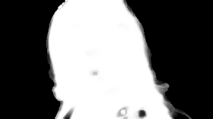
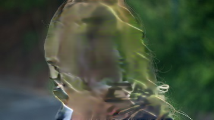
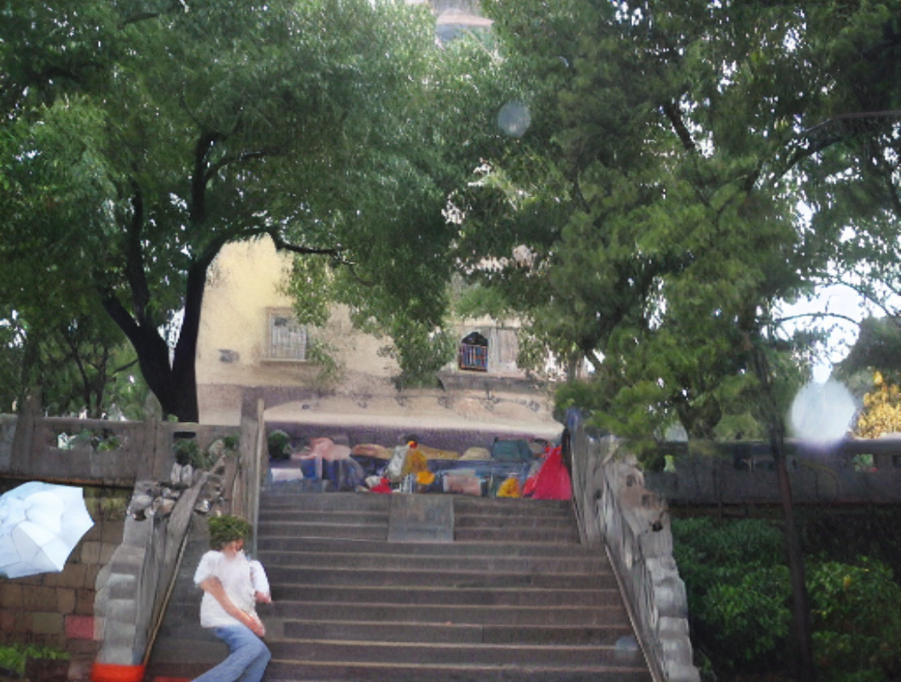

# Aexis

Aexis is a self-contained, on-device inference engine for Unity. It imports and executes selected ONNX and NCNN model graphs on a texture-native GPU path, with compute shaders and Pack4 RenderTexture storage designed for real-time applications on edge devices.

`com.aexis` is the engine package. AIImage is the complete application example built on top of it; it is not a runtime namespace or package dependency. The runtime does not wrap or require Unity Sentis, Tencent ncnn, ONNX Runtime, MNN, UniTask, or a native inference plug-in.

- **Current package:** `com.aexis` `0.1.0-pre.1`
- **Unity range:** 2022.3 through 6000.3
- **Primary production path:** Pack4 RenderTexture plus CommandBuffer-compatible compute dispatch

## What Aexis Provides

- A self-owned ONNX protobuf reader, graph lowering, shape/index planner, and ONNX execution path.
- A self-owned NCNN `.param` and `.bin` reader, graph loader, and texture-native Pack4 backend.
- Package-owned compute shaders loaded from `Runtime/Resources/Aexis`.
- Import support for `.onnx`, NCNN `.param`/`.bin`, and versioned `.aexis` (`AEXM`) model archives.
- Public runtime assemblies: `Aexis`, `Aexis.Async`, `Aexis.Onnx`, `Aexis.Ncnn`, and `Aexis.Execution`.
- Importable samples, including the full **AIImage Main2 Application Example** and reusable runner components.

The engine keeps logical tensor shapes separate from physical storage shapes. In the NCNN production path, activations remain texture-backed. A strict plan rejects unsupported or unplanned command-buffer allocations instead of silently falling back to a transient ComputeBuffer activation.

## Examples

The images below are documentation copies of actual runner artifacts. Unless marked **archived**, timings are Windows/Vulkan batch results captured on 2026-07-28. They are evidence for the listed input and environment, not universal performance claims.

### Qwen3.5 0.8B Mobile Q4 and Q8


| Variant | Runner evidence | Strict texture execution | Result |
| --- | --- | --- | --- |
| Q4 | Text smoke report, 65.533 s, 48 cache textures | Yes; no ComputeBuffer fallback | Valid execution; generated one end-of-turn token and no visible response text. This is a smoke result, not a quality demo. |
| Q8 | Multimodal smoke with the image above, 71.618 s, 6 generated tokens | Yes; texture-backed activations and no ComputeBuffer fallback | Valid execution; generated text begins with a Chinese-language phrase. |

The Q4 and Q8 labels describe mobile model archive formats. They do not imply that every engine operator supports generic INT4 or INT8 execution.

### CLIP MobileCLIP S0

CLIP produces an embedding and ranked labels rather than a transformed image. The latest successful score artifact ranked `Photo` at `0.332389` and `Portrait` at `0.265945` (2026-07-23). A new strict CommandBuffer run on 2026-07-28 deliberately failed at `transpose_121`: its loaded profile did not declare a required temporary `512x64 RHalf` RT. The rejection confirms the strict no-fallback guard and is tracked as a current runner limitation.

### CodeFormer Face Restoration


The face-restoration runner completed in **16,075 ms** on `ref/test_img.jpg`.

### Foreground Matting




The matting runner completed at **360x202** in **1,103 ms** with the strict texture plan and CommandBuffer path.

### GFPGAN Face Restoration


The GFPGAN runner completed in **4,786 ms**. Its weights are excluded from the package payload and are delivered separately.

### YOLO Person Segmentation plus DeepFillV2




YOLO found one person in **1,529 ms** (mask coverage `0.460974`); the NCNN DeepFillV2 pass completed in **1,686 ms** (`1,542 ms` inference).

### Real-ESRGAN AnimeVideo v3 x4


The Pack4 CommandBuffer-only validation completed in **661 ms** for `ref/03.jpg`. The compared output had RGB mean and maximum absolute difference of `0` against the paired run.

### YOLO plus Stable Diffusion Inpainting



This is an **archived validated artifact** captured on 2026-07-16, not a fresh 2026-07-28 benchmark. Stable Diffusion inpainting weights are external and are not included in the package sample.

### MONAI and VISTA

> **Screenshot slot reserved for validated medical input.**
>
> No medical screenshot is published here. MONAI/VISTA weights and data are external to the package, and a visual sample will be added only after a reproducible run with distributable input and the applicable data/model permissions.

## Model Releases

The application resolves model assets from [newzjh/AIImage releases](https://github.com/newzjh/AIImage/releases). The release pages below are the corresponding download locations; select the current asset listed on the page or use the application's model-download UI. Generated archive names are taken from `AIImageModelReleaseManifest.json` produced by `Aexis/Release/Build Reduced/Prepare Model Release Assets` rather than guessed in documentation.

| Runner or model group | GitHub Release download page | Package payload |
| --- | --- | --- |
| Qwen3.5 mobile Q4, CLIP, CodeFormer, Matting, YOLO, SD inpainting configuration | [`model`](https://github.com/newzjh/AIImage/releases/tag/model) | Q4/CLIP/CodeFormer/Matting/YOLO are group-dependent; SD weights are external. |
| Qwen3.5 mobile Q8 | [`qwen3.5_0.8b_mobile_q8`](https://github.com/newzjh/AIImage/releases/tag/qwen3.5_0.8b_mobile_q8) | External download. |
| Real-ESRGAN | [`realesr`](https://github.com/newzjh/AIImage/releases/tag/realesr) | Default Real-ESRGAN NCNN pair is allowed only after provenance review. |
| GFPGAN | [`gfpgan`](https://github.com/newzjh/AIImage/releases/tag/gfpgan) | External download; not in the package sample. |
| DeepFillV2 | [`DeepFileV2`](https://github.com/newzjh/AIImage/releases/tag/DeepFileV2) | Default NCNN case is sample-dependent; verify its release record. |
| MONAI / VISTA | No package release asset | Obtain upstream model and data only under their own terms. |

Release tags are part of the application delivery configuration. A successful download does not grant a model license; see [model distribution](Packages/com.aexis/Documentation~/model-distribution.md) before redistributing a model artifact.

## Operator and Precision Coverage

The generated [operator capability snapshot](output/operator-capabilities/operator-capabilities.json) is the source of the following counts. It is an implementation-status snapshot, not a promise that every imported graph will run.

| Import family | Import entries | RenderTexture + CommandBuffer entries | FP32 flagged entries | Interpretation |
| --- | ---: | ---: | ---: | --- |
| NCNN | 96 | 56 | 90 | Self-owned NCNN import and Pack4 execution coverage. Strict planning can still reject an operator/profile. |
| Sentis/ONNX | 19 | 13 | 13 | ONNX/Sentis-dialect import and lowering coverage. Aexis does not use Sentis or ONNX Runtime as a runtime backend. |

The snapshot contains 56 `partial`, 29 `debug-only`, 5 `alias-only`, and 6 `unsupported` operator entries. A `partial` entry may have a texture branch for selected shapes but has not passed full Pack4 CommandBuffer model validation. Treat the strict preflight result for the concrete model as authoritative.

`ModelManifest` supports FP32, FP16, BF16 storage, INT8/INT4 weight-only metadata, calibrated W8A8 plans, per-layer mixed precision, and precision gates. Actual checked-in manifests include model-specific INT8/INT4 profiles for MobileCLIP/Matting and FP16/FP32 profiles for selected runners. The capability snapshot reports zero universal per-operator FP16/INT8 flags, so this repository does **not** claim blanket FP16 or INT8 coverage. BF16 storage uses FP32 RenderTexture storage with deterministic Pack4 cast rounding because Unity has no portable BF16 RenderTexture format.

## Tested Environment

Compatible Unity targets and completed validation are different claims. The current completed runner evidence is the Windows row below. Fill the blank hardware and timing fields on the destination machine before marking the remaining rows as passed.

| Platform | Device / GPU | Unity | Graphics API | Current runner evidence | Status |
| --- | --- | --- | --- | --- | --- |
| Windows 11 Pro 64-bit | Intel Arc Graphics | 6000.2.7f2 | Vulkan | CodeFormer 16,075 ms; Matting 1,103 ms; GFPGAN 4,786 ms; YOLO + DeepFillV2 1,529 + 1,686 ms; Real-ESRGAN 661 ms | Passed for the documented runs |
| macOS | **TBD: machine and GPU** | **TBD: Unity version** | **TBD** | Existing build-failure log at `Tools/AIImage_MACOS.build-failure.txt`; no passing measurement recorded | Blocked / not validated |
| Android phone | **TBD: model, SoC, GPU** | **TBD: Unity version** | **TBD** | **TBD: build, thermal state, runner, timing** | Not yet validated |
| iPhone / iPad | **TBD: model, SoC, GPU** | **TBD: Unity version** | **TBD** | **TBD: build, thermal state, runner, timing** | Not yet validated |

Use a real graphics device for all Aexis validation. `-nographics` is not a valid package, shader, or runner test mode.

## How to Install

### UPM

Use an embedded package reference during development:

```json
{
  "dependencies": {
    "com.aexis": "file:../AIImage/Packages/com.aexis"
  }
}
```

For a published registry or Git package, install `com.aexis` through Unity Package Manager. Do not copy `Runtime` into `Assets`; the package's assembly definitions and package-owned resources are part of the runtime contract.

### `.unitypackage`

From an Aexis project, run `Aexis/Release/Export Complete UnityPackage`, then import the resulting archive into the target Unity project. The editor bootstrap restores `Packages/com.aexis` and registers it with Package Manager.

To import the full application example, select **AIImage Main2 Application Example** in Package Manager, then run:

```text
Aexis/Examples/Install Main2 Application StreamingAssets
```

Open `Scenes/Main2.unity`, or choose `Aexis/Examples/Open Main2 Application Scene`. The installer copies the sample payload to `Assets/StreamingAssets`, which is the Player-included location. Model paths are relative to `Application.streamingAssetsPath`.

## License

The package manifest declares **MIT** for Aexis source. Model weights, medical data, and third-party sample artifacts are not covered by that source license and retain their own terms.

This pre-release repository still contains a release-audit gate in [Packages/com.aexis/LICENSE.md](Packages/com.aexis/LICENSE.md). Complete the source, shader, sample, and model provenance audit before publishing or representing a package archive as an MIT release. See [Third Party Notices](Packages/com.aexis/Third%20Party%20Notices.md) and [model distribution](Packages/com.aexis/Documentation~/model-distribution.md).

## Documentation

- [Package README](Packages/com.aexis/README.md)
- [Integration manual](Documents/Aexis-Engine-Integration-Manual.md)
- [Runner sample guide](Packages/com.aexis/Documentation~/runner-samples.md)
- [Model distribution and exclusions](Packages/com.aexis/Documentation~/model-distribution.md)
